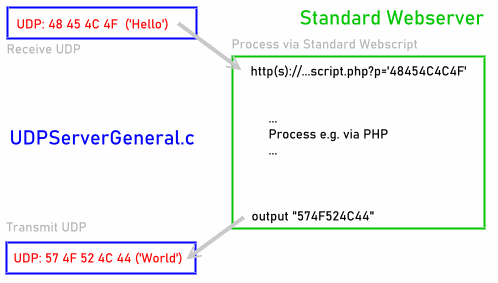

# 'UDPServerGeneral' - UDP<->TCP Bridge
_A simple Server in C for easy UDP processing via e.g. PHP_

Standard Servers (Apache, nginx, ..) only work with TCP connections.
Sometimes IoT devices use UDP. However, complete UDP Servers are complex.
But mapping UDP to e.g. PHP and back is a very simple solution.

This small UDP Server in C sends all incomming UDP via Curl/libcurl 
to a Standard Server (e.g PHP) and the result back via UDP. 
Developed for use with LTX-Microcloud.

For simplicity, the complete server is in one single C Source ;-)

Compile it on the Server and run it as Service.

## A Minimum Script in PHP
...
	<?php
		header('Content-Type: text/plain');
		$hexplbe = @$_REQUEST['p'];
		if (!isset($hexplbe)) die("#ERROR: No Payload");
		$paybytes = @unpack('C*', hex2bin($hexplbe));
		$paycount = count($paybytes);
		if(!$paycount) die("#ERROR: Payload Format ('$hexplbe')");
		$payrep =  bin2hex(pack("CN", $paycount,time()));
		echo $payrep; // Output: Cnt.u8 Time.u32
	?>
...

## Installation/Test ##
- Tested with Visual Studio (Windows) and GCC
- For details see Sourcecode
- Here is HowTo install a System Service on UBUNTU Linux: *todo*

## Links ##
- Curl/libcurl: https://curl.se
***
